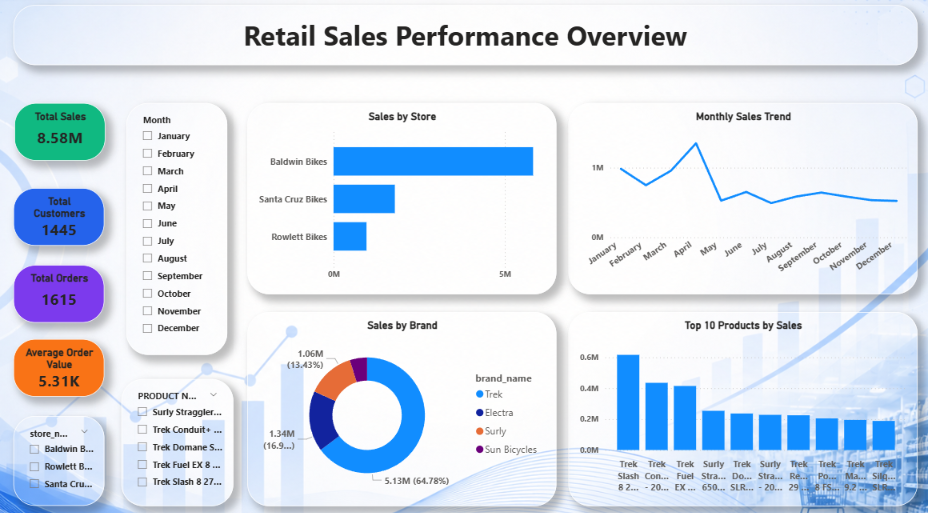
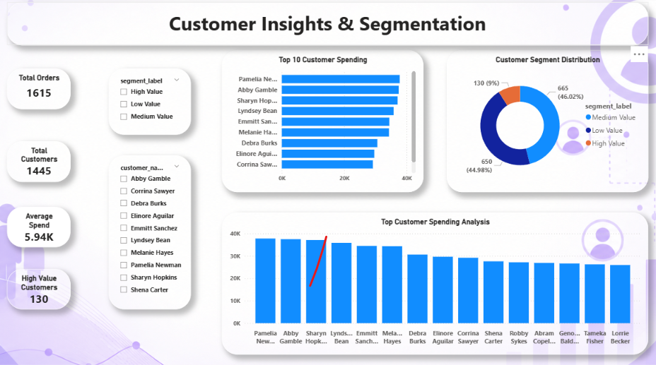
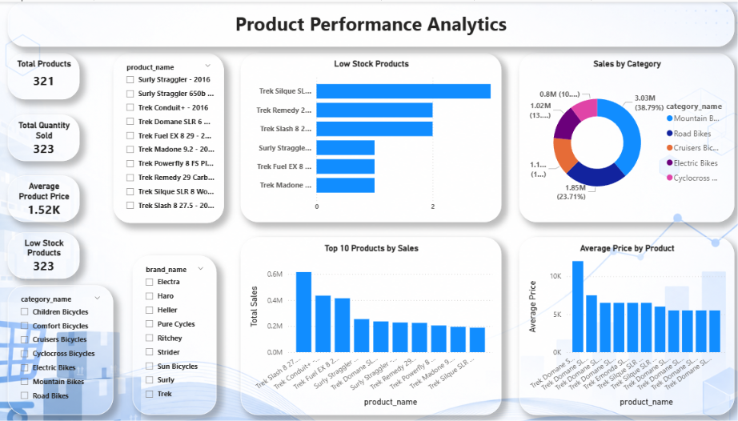
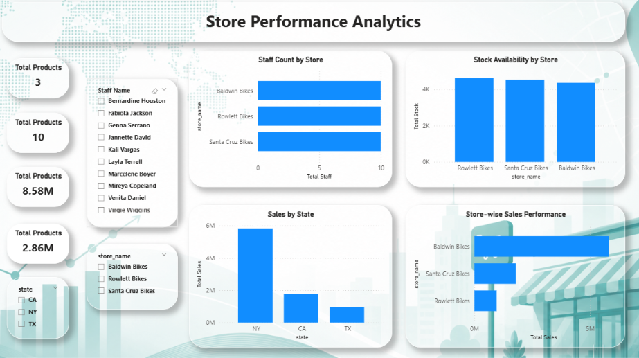

# Retail Sales Analytics using SQL & Power BI

## 📊 Project Overview

This project is an end-to-end Retail Sales Analytics solution developed using SQL and Power BI.

The project analyzes retail business data across sales, customers, products, brands, inventory, staff, and stores to identify business trends and generate actionable insights.

---

## 🎯 Project Objectives

- Analyze overall retail sales performance
- Identify monthly sales trends
- Analyze store-wise and state-wise sales
- Identify top-performing products and brands
- Segment customers based on spending behavior
- Analyze product category performance
- Monitor stock availability and low-stock products
- Compare store performance and staff distribution

---

## 🛠️ Tools & Technologies

- **SQL** – Data querying and business analysis
- **Power BI** – Interactive dashboards and visualization
- **CSV** – Dataset storage
- **GitHub** – Project documentation and version control

---

## 📁 Dataset

The project contains multiple relational datasets:

| Dataset | Description |
|---|---|
| Brands | Brand information |
| Categories | Product category information |
| Customers | Customer details |
| Orders | Order transaction data |
| Order Items | Product-level order details |
| Products | Product information |
| Staffs | Store staff information |
| Stocks | Inventory and stock information |
| Stores | Store and location information |

---

## 📊 Dashboard Pages

### 1. Retail Sales Performance Overview

Provides an overview of:

- Total Sales
- Total Customers
- Total Orders
- Average Order Value
- Sales by Store
- Monthly Sales Trend
- Sales by Brand
- Top 10 Products by Sales

### 2. Customer Insights & Segmentation

Analyzes:

- Customer Spending
- Customer Segments
- High, Medium and Low Value Customers
- Top Customer Spending
- Customer Distribution

### 3. Product Performance Analytics

Analyzes:

- Product Count
- Quantity Sold
- Product Prices
- Category Sales
- Top Products
- Low Stock Products

### 4. Store Performance Analytics

Analyzes:

- Staff Count by Store
- Stock Availability
- State-wise Sales
- Store-wise Sales Performance

---

## 📈 Key Performance Indicators

- **Total Sales:** 8.58M
- **Total Customers:** 1,445
- **Total Orders:** 1,615
- **Average Order Value:** 5.31K

---

## 💡 Key Insights

- Baldwin Bikes generated the highest sales among the analyzed stores.
- April recorded a strong sales performance compared with several other months.
- Trek products contributed significantly to overall sales.
- Customer segmentation identified high-value customers based on spending.
- Product-level analysis helped identify top-performing and low-stock products.
- Store and state-level analysis provided insights into regional sales performance.

---

## 🖥️ Dashboard Preview

### Retail Sales Performance Overview



### Customer Insights & Segmentation



### Product Performance Analytics



### Store Performance Analytics



---

## 📂 Project Structure

```text
retail-sales-analytics-powerbi/
│
├── data/
│   ├── brands.csv
│   ├── categories.csv
│   ├── customers.csv
│   ├── order_items.csv
│   ├── orders.csv
│   ├── products.csv
│   ├── staffs.csv
│   ├── stocks.csv
│   └── stores.csv
│
├── sql/
│   └── retail_sales_analysis.sql
│
├── powerbi/
│   └── Retail_Sales_Analytics_Dashboard.pbix
│
├── screenshots/
│   ├── 01-sales-performance-overview.png
│   ├── 02-customer-insights.png
│   ├── 03-product-performance.png
│   └── 04-store-performance.png
│
└── README.md
## 🚀 Project Workflow

Raw Data
   ↓
Data Preparation
   ↓
SQL Analysis
   ↓
Data Modeling
   ↓
Power BI Dashboard
   ↓
Business Insights

## 🖥️ Dashboard Preview

## 📂 Project Structure

## 👨‍💻 Author

**Praveen S**

M.Sc. Computer Science

Data Analytics | SQL | Power BI | Excel
